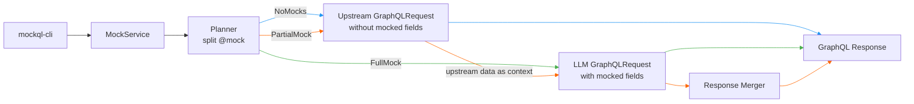

# AGENTS.md

`mockql-rs` — directive-driven GraphQL response mocking via `@mock`.

## Workspace Layout

- `crates/mockql-core/` — library: planning, prompts, upstream, providers, merge
  - `graphql/` — parse, extract `@mock`, filter ops, prompts, merge responses
  - `schema/` — SDL load + introspection
  - `llm_provider/` — model providers
  - `upstream/` — HTTP GraphQL client
  - `planner.rs`, `service.rs` — split + orchestration
- `crates/mockql-cli/` — `mockql` cli binary
- `xtask/` — dev tasks
- `docs/` — `@mock` spec, provider-cli docs

## Architecture

