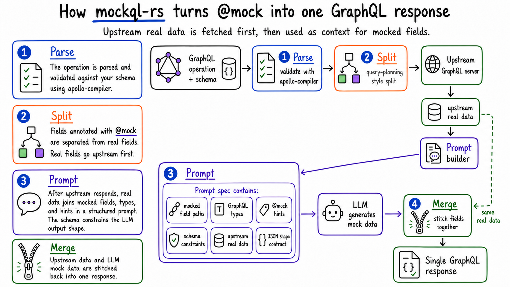

# mockql

Focus on the feature, not the fixture. GenAI-powered GraphQL response mocking via the `@mock` directive.

`mockql` is a thin, composable and standalone CLI that **decorates** any GraphQL server. 
A CLI is the smallest possible integration surface: any language, agent, script, or demo environment can run a process.

[](LICENSE-APACHE)
[](https://crates.io/crates/mockql-cli)

## Prerequisites
- One supported provider CLI installed and available on `PATH`
    - `claude`
    - `codex`
    - `opencode`
- Or an HTTP-backed provider with credentials.
    - `github-copilot`
    - `gemini`

## Install

```bash
curl -fsSL https://raw.githubusercontent.com/ExpediaGroup/mockql-rs/main/install | sh
```

Pin a version or choose a different install directory with environment variables:

```bash
curl -fsSL https://raw.githubusercontent.com/ExpediaGroup/mockql-rs/main/install | MOCKQL_VERSION=v0.0.4 sh
curl -fsSL https://raw.githubusercontent.com/ExpediaGroup/mockql-rs/main/install | MOCKQL_INSTALL_DIR="$HOME/bin" sh
```

Install with Cargo

```bash
cargo install mockql-cli
```

## Demo

All use cases below use the public SWAPI GraphQL endpoint at <https://swapi-graphql.netlify.app>.

### Contextual field mocking

The real power shows up when you need *most* of a response from your actual backend, but one field isn't ready yet: 
Fetch real data like film `title` while mocking fields like `openingCrawl` and `director` in [`partial-list-items.graphql`](examples/swapi/partial-list-items.graphql).


### Full mock

Generate the full operation response from the provider  in [`full-mock.graphql`](examples/swapi/full-mock.graphql).


### Nested object fields

Mock fields deep inside nested character data while preserving the real film query shape in [`nested-object-fields.graphql`](examples/swapi/nested-object-fields.graphql).


### Schema extension

Fetch real film data and `@mock` an extended `productionBrief` field in [`schema-extension-example.graphql`](examples/swapi/schema-extension-example.graphql).


## How it works



`mockql` sits between your client and server as a thin layer. For every request it will:

- **Parse** — the operation is parsed and validated against your schema using [apollo-compiler](https://crates.io/crates/apollo-compiler).
- **Split** — `@mock`-annotated fields are separated from real fields. Real fields are forwarded upstream as normal. (If you know GraphQL Federation, this feels a lot like query planning.)
- **Prompt** — the operation, mocked fields, hints, and the relevant schema subset are assembled into a structured prompt. The operation and schema constrain the output shape: the LLM can't hallucinate fields that don't exist or return a string where an enum is expected.
- **Merge** — real upstream data and LLM-generated mock data are stitched back into a single response.

## Documentation

- [Getting started](https://opensource.expediagroup.com/mockql-rs)
- [`@mock` directive specification](docs/mock-specification.md)

## Examples

- [`swapi`](examples/swapi/README.md)
- [`countries`](examples/countries/README.md)
- [`pokemon`](examples/pokemon/README.md)
