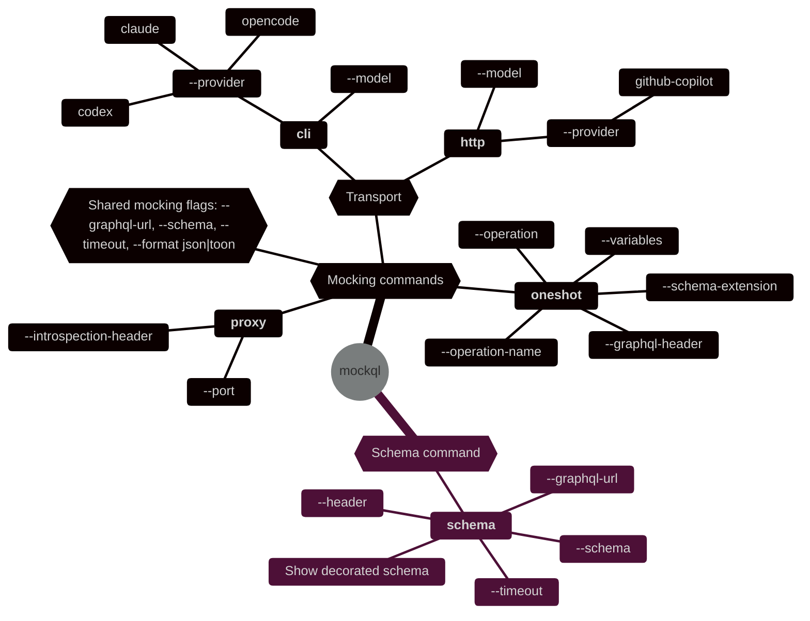

# MockQL Rust

Gen AI GraphQL response mocking via `@mock` directive.

## 📋 Specification

The `@mock` directive specification lives in [`docs/mock-specification.md`](./docs/mock-specification.md).

## 🎯 What It Does

`mockql` lets you annotate a GraphQL operation with `@mock` and generate only the mocked portions with an LLM provider. 
The upstream GraphQL server does not need to define the `@mock` directive. `mockql` decorates the schema with it automatically while loading it (locally or via introspection).

Depending on where `@mock` appears, `mockql` will:

- Pass the operation straight through to the upstream GraphQL server
- Generate the full response with an LLM provider
- Fetch real upstream data for non-mocked fields, then merge in generated mock data for mocked fields

## 📦 Workspace Layout

- [`crates/mockql-core`](./crates/mockql-core): Core crate
- [`crates/mockql-cli`](./crates/mockql-cli): CLI crate and `mockql` binary
- [`docs/mock-specification.md`](./docs/mock-specification.md): `@mock` directive semantics
- [`docs/provider-cli.md`](./docs/provider-cli.md): provider prerequisites and exact CLI integration details
- [`examples/swapi`](./examples/swapi): SWAPI GraphQL examples
- [`examples/countries`](./examples/countries): Countries GraphQL examples

## 📜 Prerequisites

- One supported provider CLI installed and available on `PATH`
  - `claude`
  - `codex`
  - `opencode`
- Or an HTTP-backed provider with credentials.
  - `github-copilot` (requires `GITHUB_TOKEN` env variable)
- Network access to the target GraphQL endpoint unless you supply a local schema with `--schema`

## 🔨 Build

```bash
cargo build -p mockql
```

Run the binary with:

```bash
cargo run -p mockql-cli -- --help
```

Or directly after building:

```bash
./target/debug/mockql --help
```

## ⌨️ Usage

```bash
mockql oneshot --operation <file.graphql> --graphql-url <https://example.com/graphql> [options] cli|http
mockql proxy --port <port> --graphql-url <https://example.com/graphql> [options] cli|http
mockql schema (--schema <schema.graphql> | --graphql-url <https://example.com/graphql>) [options]
```

### 🔎 Arguments overview



#### Global Arguments

- `--schema <path>`: use a local schema SDL file instead of introspection
- `--graphql-url <url>`: introspect or execute against a GraphQL endpoint
- `--variables <path>`: JSON object file for operation variables
- `--operation-name <name>`: select a named operation from a multi-operation document
- `--schema-extension <path>`: SDL extension file applied before planning
- `--graphql-header name:value`: add request headers to introspection and upstream execution
- `--introspection-header name:value`: add request headers to proxy startup introspection
- `--header name:value`: add request headers to `schema --graphql-url` introspection
- `--timeout <duration>`: provider timeout such as `30s` or `2m`
- `--format <json|toon>`: prompt serialization format

#### Subcommands

- `oneshot`: execute one mock-aware GraphQL operation and print the response
- `proxy`: start an HTTP proxy server that mocks GraphQL responses
- `schema`: print the decorated GraphQL schema from a local SDL file or upstream introspection

#### Schema Loading

If `--schema` is omitted, `mockql` introspects the schema from `--graphql-url` and injects the built-in `@mock(hint: String)` directive definition when the upstream schema does not already define it.
If `--schema-extension` is provided, its SDL is applied during planning so you can mock fields or types that are not present in the base schema.

#### LLM Provider

- `cli --provider <claude|codex|opencode> [--model <name>]`: shell out to a local provider CLI
- `http --provider <github-copilot> --model <name>`: use an HTTP-backed provider

`--model` is optional under `cli` and defaults per backend:

- `cli --provider claude` => `sonnet`
- `cli --provider codex` => `gpt-5.4-mini`
- `cli --provider opencode` => `github-copilot/gemini-3-flash-preview`

## Quick Start Examples

### SWAPI

```bash
cargo run -p mockql-cli -- oneshot \
  --operation ./examples/swapi/partial-list-items.graphql \
  --variables ./examples/swapi/partial-list-items.json \
  --graphql-url https://swapi-graphql.netlify.app/graphql \
  cli --provider codex --model gpt-5.4-mini
```

```bash
cargo run -p mockql-cli -- oneshot \
  --operation ./examples/swapi/partial-list-items.graphql \
  --variables ./examples/swapi/partial-list-items.json \
  --graphql-url https://swapi-graphql.netlify.app/graphql \
  cli --provider opencode --model github-copilot/gemini-3-flash-preview
```

### Countries API

```bash
cargo run -p mockql-cli -- oneshot \
  --operation ./examples/countries/contextual-hint.graphql \
  --variables ./examples/countries/contextual-hint.json \
  --graphql-url https://countries.trevorblades.com/ \
  cli --provider codex --model gpt-5.4-mini
```

For more example commands, see:

- [`examples/swapi/README.md`](./examples/swapi/README.md)
- [`examples/countries/README.md`](./examples/countries/README.md)
